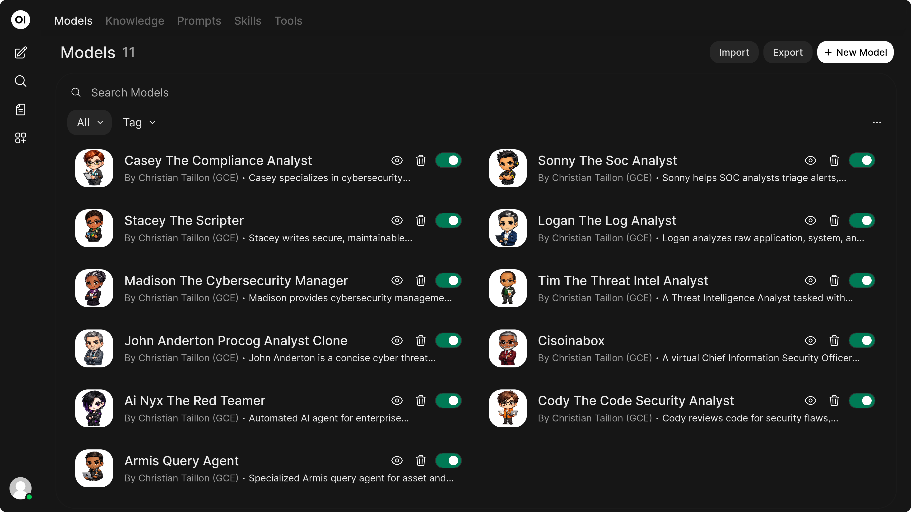

# Agents

Security operations agents, commands, and skills authored locally as markdown and designed to run across multiple harnesses.

This repository is focused on building agents that are:

- guided by durable operating instructions and repeatable workflows
- guarded by explicit scope, safety, and action rules
- connected to security tools and platform-specific capabilities where appropriate
- able to work together as specialized roles to solve operational problems

The result is a practical, source-controlled system for security operations and security services work, including Armis-driven asset intelligence, vulnerability analysis, SOC triage, threat intelligence, code security review, compliance guidance, scripting, and vCISO support.



## Overview

This repository is the local source of truth for:

- agents in `.opencode/agents/`
- commands in `.opencode/commands/`
- skills in `.opencode/skills/`
- optional avatar assets in `.opencode/images/`

It is built around a simple operating model:

1. Author locally
2. Review locally
3. Validate locally
4. Publish outward when needed

OpenCode is the primary authoring environment. OpenWebUI is a publishing and runtime target. The content itself is intentionally markdown-first and harness-friendly so it can be adapted to other runtimes that consume structured agent instructions.

## Design Goals

- Keep durable agent behavior in version-controlled markdown
- Preserve portability across harnesses and runtimes
- Encode operational guidance, constraints, and safety rules directly in the artifacts
- Support specialist agents that can collaborate on multi-part security work
- Keep publishing separate from authoring so local files remain authoritative

## Operating Model

### Local Development

The expected local workflow is straightforward:

1. `git clone` the repository into a working directory
2. Open that checkout in OpenCode
3. Edit the markdown artifacts under `.opencode/`
4. Review and validate changes locally
5. Use the sync tooling only when you intend to publish to OpenWebUI

### Production Runtime

In production, the repository is consumed from a containerized working directory:

1. The container performs a `git pull` to refresh the checkout
2. OpenCode opens that working directory inside the container
3. The same markdown source of truth is available at runtime
4. Publishing or import operations run from that updated checkout when needed

This model keeps local authoring, source control, and runtime behavior aligned.

## Compatibility

The repository is designed to be compatible with multiple harnesses by keeping the core assets simple and portable:

- agent definitions live in markdown files
- commands are markdown-based routing prompts
- skills are markdown playbooks rather than embedded application logic
- the `openwebui/` package is an adapter layer for sync and API interactions, not the source of truth

That separation allows the same repo to serve as an OpenCode-native workspace while remaining adaptable to other agent harnesses.

## Repository Layout

```text
.opencode/
  agents/      # Durable agent personas and operating rules
  commands/    # Slash-style routing prompts
  skills/      # Reusable workflow guidance and playbooks
  images/      # Optional profile images and avatar assets
  package.json # OpenCode plugin dependency
openwebui/     # Python sync and API tooling for OpenWebUI
AGENTS.md      # Detailed project guide and operating conventions
README.md      # Project overview
```

Trimmed `.opencode/` tree:

```text
.opencode/
  agents/
    ai-nyx-the-red-teamer.md
    armis-query-agent.md
    casey-the-compliance-analyst.md
    cisoinabox.md
    cody-the-code-security-analyst.md
    john-anderton-procog-analyst-clone.md
    logan-the-log-analyst.md
    madison-the-cybersecurity-manager.md
    soc-analyst.md
    sonny-the-soc-analyst.md
    stacey-the-scripter.md
    tim-the-threat-intel-analyst.md
  commands/
    search-armis.md
    search-device.md
    search-vulnerabilities.md
    sync.md
  skills/
    README.md
  images/
  package.json
```

The tree above intentionally omits cache files, generated Python bytecode, and other low-value runtime noise.

## What The Agents Do

The repository includes specialist agents for:

- Armis query and asset intelligence
- SOC analysis and triage
- threat intelligence research
- code security review
- secure scripting
- compliance and governance analysis
- cybersecurity management
- vCISO-style advisory support

These agents are meant to be useful individually, but the broader design is collaborative: each agent carries instructions, boundaries, and task-specific behavior so multiple roles can contribute to solving a larger security problem.

## OpenWebUI Sync Tooling

The `openwebui/` Python package provides local tooling for planning, pushing, importing, and exploring OpenWebUI content.

Common commands:

```bash
uv run --project openwebui python -m openwebui sync plan
uv run --project openwebui python -m openwebui sync push agents
uv run --project openwebui python -m openwebui sync push commands
uv run --project openwebui python -m openwebui sync push skills
uv run --project openwebui python -m openwebui sync push all
uv run --project openwebui python -m openwebui sync import agents
```

Practical rules:

- treat local markdown as authoritative
- run `sync plan` before push or import operations
- use publishing intentionally rather than as part of normal editing
- keep runtime-specific sync behavior out of the durable agent content unless it materially matters

## Primary Use Cases

- Armis environment search and analysis
- repeatable security triage workflows
- security operations and services delivery
- reusable specialist personas with explicit guidance and guardrails
- local-first authoring with controlled publication to OpenWebUI

## Additional References

- `AGENTS.md` contains the detailed project guide, inventory, and conventions
- `AGENTIC-SYSTEM-PROMPT-STYLE-GUIDE.md` documents prompt design guidance
- `AI-AVATAR-PROMPT-STYLING-GUIDE.md` documents avatar generation guidance
